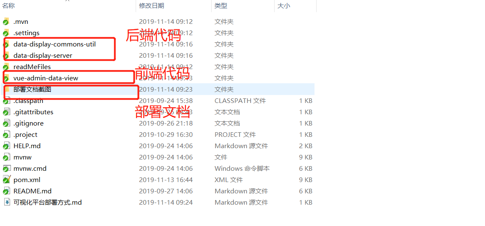
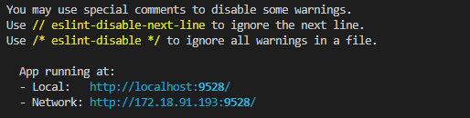
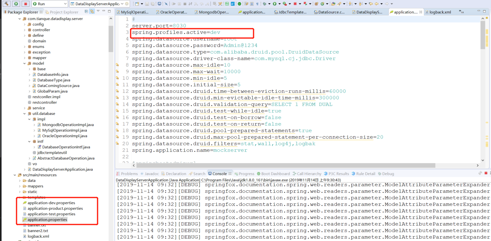
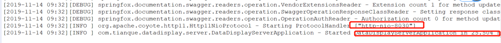
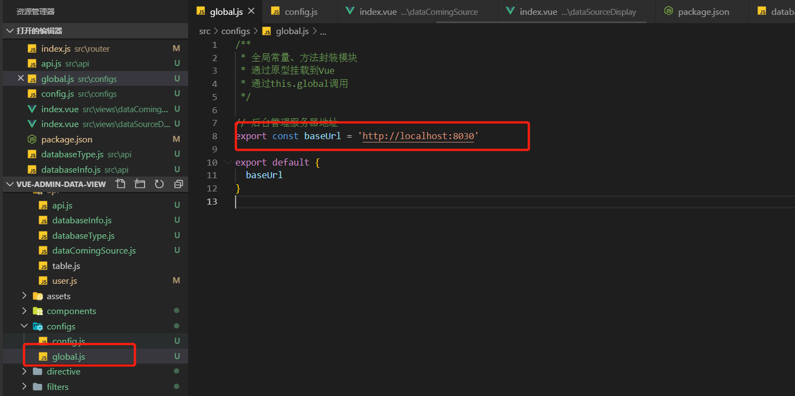

# 可视化平台部署方式

## 一、简述

该平台采用前后端分离模式开发
- 前端采用vue + elementUI ,主要采用vue-admin-template的模版结构开发
- 后端依旧采用springboot开发

## 二、部署

由上可得出部署应当分前后端分别部署。

项目总体结构如下：



### 2.1 前端部署

前端部署因为采用vue，所以依赖于node.js环境。node.js环境安装请自行百度。
以下是部署步骤：
- 进入前端工程所在路径运行: 
```shell 
    npm install
```
- 依旧在同一个目录运行：
```shell

    npm  run dev
```

成功之后会有如下图的提示：




### 2.2 后端部署

由于后端采用springboot开发，可直接打jar包运行，如果想用tomcat打war包部署，则需要自行解决。

由整体结构图可看出，后端主要代码在data-display-server工程中，该后端工程依赖同级工程data-display-commons-util,因此打包可直接在server工程中运行。

如下所示:

- 第一步: 安装依赖。
  在主工程下(也就是整个代码的父目录)，运行如下命令先把依赖安装到本地。
  ```shell
    mvn install
  ```

- 第二步：编译打包。进入data-display-server文件夹，运行如下命令：
    ```shell
        mvn package
    ```
- 第三步：运行jar包。运行成功之后，进入到data-display-server/target文件夹下，发现有一个test-service-platform-server-0.0.1.jar，以java形式运行该jar包即可
    ```shell
    nohup java -jar test-service-platform-server-0.0.1.jar  > log.file 2>&1 &
    ```

    或者不进入target目录运行：

    ```shell
    nohup java -jar target/test-service-platform-server-0.0.1.jar  > log.file 2>&1 &
    ```
    两种命令等效。

- 第四步： 查看运行日志。
  ```shell
    tail -200f log.file
  ```


备注：
后端代码部署时，如果想修改数据库地址，在application-*.properties中。或者自己新建额外的application-*ABC.properties,那么修改application.properties中的active profile即可。

如下图所示：


### 2.3 前后端对接

既然采用前后端分离模式开发，那么前后端需要进行对接。交互模式采用http方式，因此需要前端知道后端代码的访问url。

后端部署之后，一般可通过日志查看运行端口，如下图所示：



可看出该后端应用启动在8030端口，那么本地访问路径为:
```shell

http://localhost:8030
```

外界访问路径为：
```
http://ip地址:8030
```

当然，纯后端没有做web，所以无法通过页面访问。


前端对接后端地址在前端工程的src/configs/global.js中控制：
如下图所示,如果后端代码变更，直接修改此处即可。


